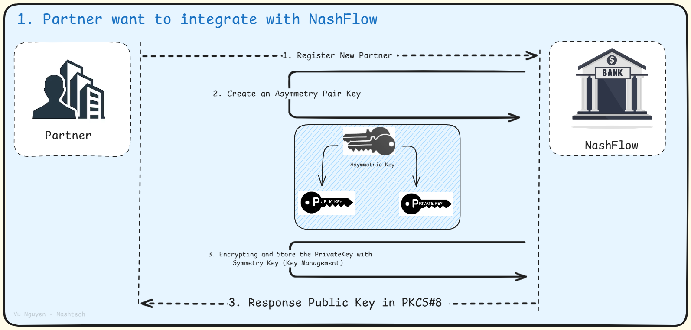
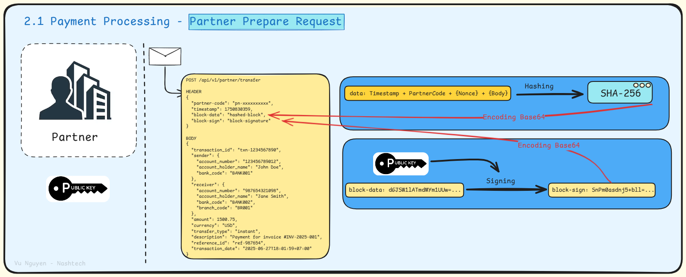

# secure-payment-api-with-cryptography
A Practical and Realistic way to Secure API for Partner in Payment Service.

## Workflows

## Author
- **Vu Nguyen Cao Nam** – The Crypto Wizard 🎩
    - **Affiliations**: @NashTech | @HCMUS Alumnus | @NashFlow Innovator
    - **Connect**: [LinkedIn](https://www.linkedin.com/in/nguyen-cao-nam-vu) | Dive into my crypto journey at [Applied Cryptography Notion](https://vunguyenhcmus.notion.site/Applied-Cryptography-21f3438179c880f5b82cd818a6838e70?source=copy_link)
    - **Timestamp**: June 28, 2025, 03:54 PM +07 – Freshly crafted for the future!